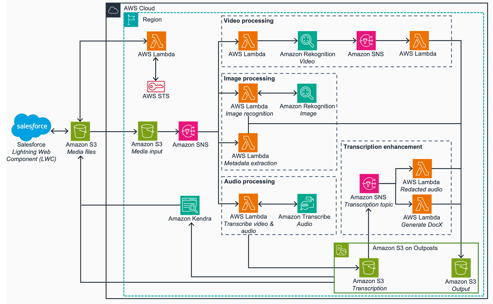
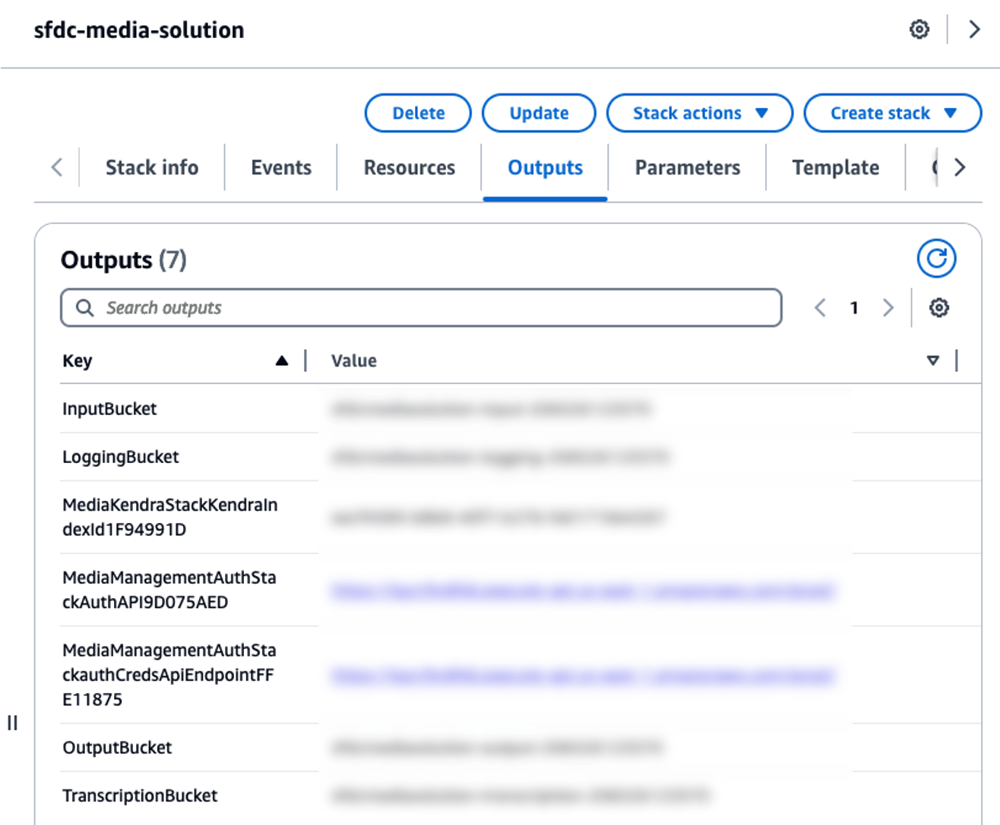
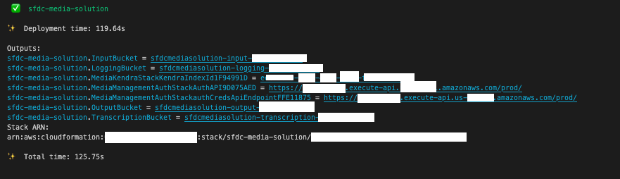
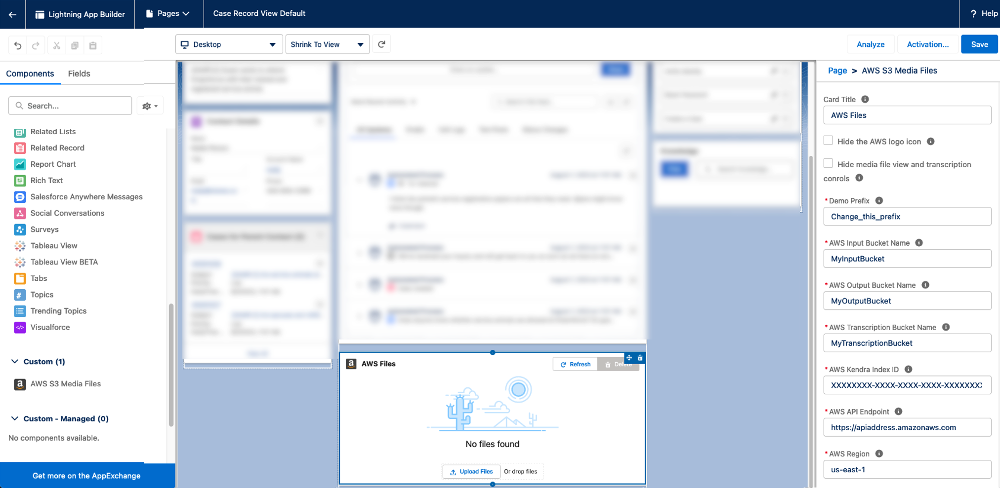
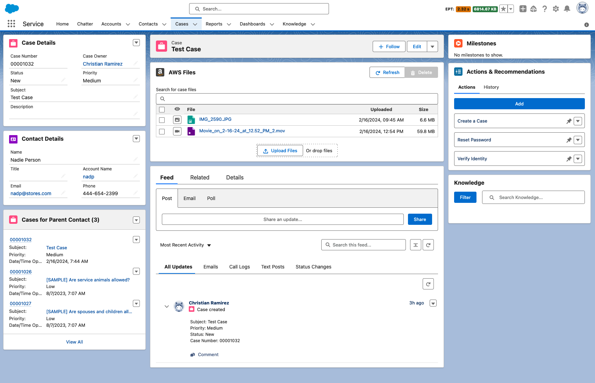
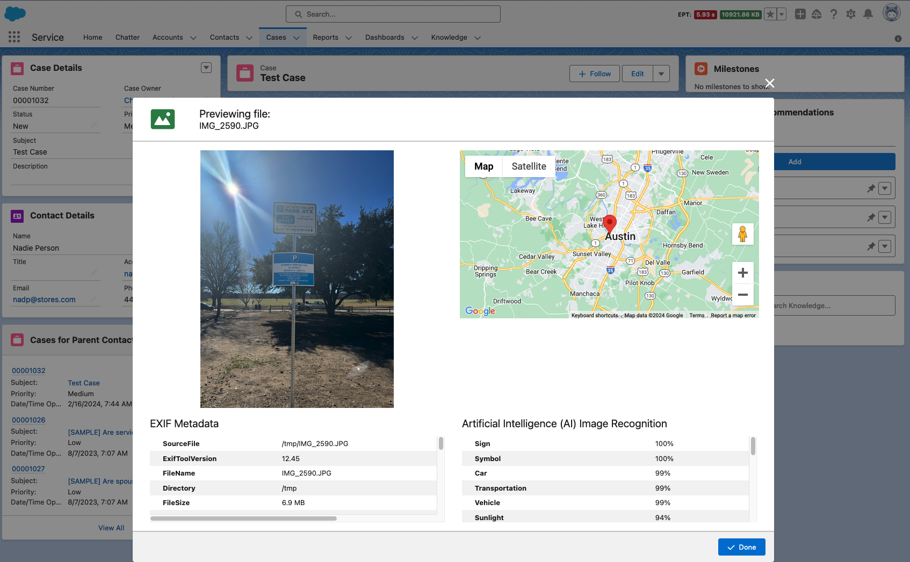
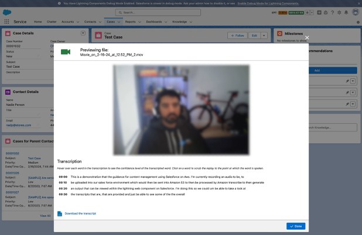
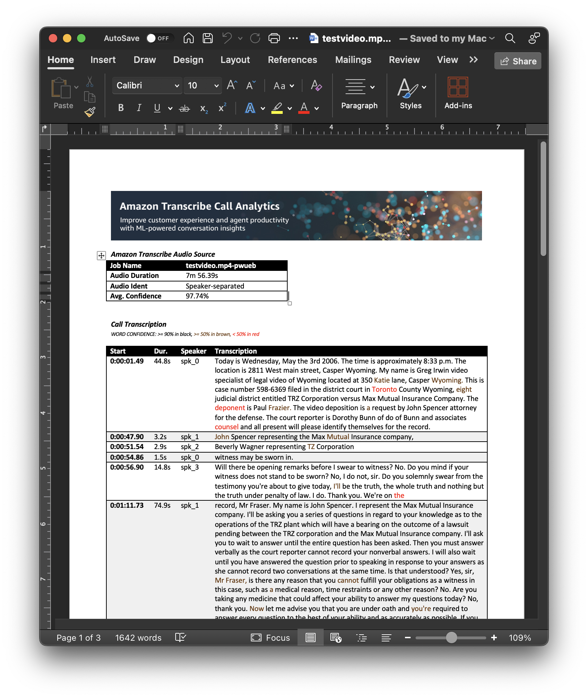

# Guidance for Content Management using Salesforce on AWS

## Table of Content
1. [Overview](#overview)
    - [Cost](#cost)
2. [Prerequisites](#prerequisites)
3. [Deployment Steps](#deployment-steps)
    - [Deploy AWS](#deploy-aws)
    - [Deploy Salesforce Lightning Web Component](#deploy-salesforce-lightning-web-component)
4. [Deployment Validation](#deployment-validation)
5. [Running the Guidance](#running-the-guidance)
    - [Supported Media Files](#supported-media-files)
6. [Next Steps](#next-steps)
7. [Cleanup](#cleanup)
8. [Notices](#notices)
9. [Authors](#authors)

## Overview
This Guidance demonstrates how to utilize advanced artificial intelligence (AI) capabilities within your existing Salesforce environment to gain more valuable insights about your customers. It allows you to seamlessly integrate the user-friendly interface of Salesforce with the powerful data storage and processing capabilities of AWS. With this Guidance, you can securely upload any type of document to store on AWS. AWS AI tools will then automatically process those documents, converting audio and video to text, creating readable documents from images, extracting key details while redacting personal data, and analyzing visuals. By combining the strength of Salesforce with the advanced AI services of AWS, you can uncover deeper insights into your customers' needs, behaviors, and preferences—all within your existing Salesforce workflows.

### Cost

You are responsible for the cost of the AWS services used while running this Guidance. As of February 2024 the cost for running this Guidance with the default settings in the us-east-1 region is approximately $875 per month for processing 1000 minutes of videos and 10000 images per month. This is not including the Amazon Kendra free tier that provides free usage of up to 750 hours for the first 30 days. This will allow you to evaluate the solution while in the free tier. Visit the [Amazon Kendra Pricing](https://aws.amazon.com/kendra/pricing) page for more information.

## Prerequisites
EC2 Image Builder will use the default Virtual Private Cloud (VPC) and default Security Group in the region where you are deploying the container build process. To ensure a successful container creation, you need to verify that the Security Group rules do not restrict the AWS Systems Manager Agent (SSM Agent) from connecting to the instance.  
If you are using the Default VPC and Default Security Group without any modifications, there should be no issues with the SSM Agent connection. However, if you have altered the inbound or outbound Security Group rules, it may prevent the SSM Agent from connecting, causing the container creation task to fail.
### Operating System
These deployment instructions are optimized to best work on a Mac or Linux environment. Deployment in Windows may require additional steps for setting up required libraries and CLI.
Using a standard [AWS Cloud9](https://aws.amazon.com/pm/cloud9/) environment will have all the AWS requirements installed.

### Software Requirements
- Install Python 3.7 or later including pip and virtualenv
- Install Node.js 14.15.0 or later
- Install [AWS CLI](https://docs.aws.amazon.com/cli/latest/userguide/getting-started-install.html)
- Install [AWS CDK Toolkit](https://docs.aws.amazon.com/cdk/v2/guide/cli.html)
- Install [Salesforce CLI](https://developer.salesforce.com/docs/atlas.en-us.sfdx_setup.meta/sfdx_setup/sfdx_setup_install_cli.htm)

### Supported Regions

This Guidance is built for regions that support Amazon Kendra. Supported regions are subject to change, so please review [Amazon Kendra endpoints and quotas](https://docs.aws.amazon.com/general/latest/gr/kendra.html) for the most up-to-date list. Attempting to deploy the CDK stack in a region where Amazon Kendra in unavailable will fail.

## Deployment Steps
This project consists of two components, which have to be deployed separately.  One to Salesforce, and one to AWS.

**BEFORE DEPLOYING**
This requires a certificate that can be used in both Salesforce and AWS.  For _DEV_ purposes, a self-signed cert is the easiest, but must be initiated on the Salesforce side.

### Generate Certificates
1. **Generate Certificates**: In the target Salesforce org, go to Setup > Certificate and Key Management > Create Self-Signed Certificate.
    * Here are instructions from Salesforce for creating a self-signed certificate: [Generate a Self-Signed Certificate](https://help.salesforce.com/s/articleView?id=sf.security_keys_creating.htm&type=5).
    * **Important:** Name that certificate `awsJWTCert`.  The component will only look for a certificate with that name.
2. Create and download the certificate.
3. There are 2 options for providing the public certificate to your AWS infrastructure:
   1. Overwrite [deployment/media-management-solution-cdk/cert.crt](deployment/media-management-solution-cdk/cert.crt) with the new certificate you just downloaded.
   2. In [app.py](deployment/media-management-solution-cdk/app.py), the path to the public certificate file is stored in the `pub_cert_path` variable. If you want to use a different file or location for the public certificate, you need to modify the value of the `pub_cert_path` variable with the path to your cert for the CDK to read in the values.

### Deploy AWS
1. The CDK must first be deployed on AWS to create the necessary resources needed for the Salesforce Lightning Web Component (LWC).
2. Follow the instruction on [Media Management CDK](deployment/media-management-solution-cdk/README.md) to configure and deploy the CDK stack in your AWS Account.
3. The outputs that will be used in configuring the Salesforce LWC can be found in the CloudFormation outputs tab, or in the CDK CLI after a successful deployment:

### Deploy Salesforce Lightning Web Component
1. Have the Salesforce CLI installed. Here are instruction to install: [Install Salesforce CLI](https://developer.salesforce.com/docs/atlas.en-us.sfdx_setup.meta/sfdx_setup/sfdx_setup_install_cli.htm)
2. Change directories to the `deployment/sfdc` directory
3. If this is your first time using the Salesforce CLI, you must first authorize your org with the CLI. Here is the [Authorization](https://developer.salesforce.com/docs/atlas.en-us.sfdx_dev.meta/sfdx_dev/sfdx_dev_auth.htm) guide. Use the option that best meets your needs. The option that meets most user's needs is [Authorize an Org Using a Browser](https://developer.salesforce.com/docs/atlas.en-us.sfdx_dev.meta/sfdx_dev/sfdx_dev_auth_web_flow.htm)

4. Run `sf project deploy start`.
   * Depending on your authorization and configuration, you may need to specify the directory and target org with additional tags. Here is an example of how this might look like: `sf project deploy start  --source-dir deployment/sfdc --target-org <org-alias>`
   * Here is a [Salesforce CLI Command Reference](https://developer.salesforce.com/docs/atlas.en-us.sfdx_cli_reference.meta/sfdx_cli_reference/cli_reference_project_commands_unified.htm#cli_reference_project_deploy_start_unified)

## Deployment Validation

Now that the Salesforce LWC and AWS CDK are deployed, you will need to add the LWC to your Case Page Layout, and insert the values of the S3 buckets, API Gateway, and Kendra ID. We are going to use the [Lightning App Builder](https://help.salesforce.com/s/articleView?id=sf.lightning_app_builder_overview.htm&type=5) to configure the Case Page and add the custom LWC to Cases.
1. Follow this guide,[Create and Configure Lightning Experience Record Pages](https://help.salesforce.com/s/articleView?id=sf.lightning_app_builder_customize_lex_pages.htm&type=5), and use your preferred method of creating a Lightning App Builder for the Cases page.
2. In the Lightning App Builder page for the Cases, add the `AWS S3 Media Files` component to pages as desired.
3. Use the outputs from the CDK Deployment for the required inputs of the `AWS S3 Media Files` component:

4. Open up a sample case, and hit Refresh on the *AWS Files* Component. If you do not get any errors, the LWC was configured correctly.
5. Next step is to upload media files.

### Common Misconfigurations
- The most common reason why you would get an error is because of the self-signed certificate. Here are some things to check:
  - Review the [generate certificates](#generate-certificates) section and make sure that you have followed all the steps.
    - Make sure that the certificate is named `awsJWTCert`

## Running the Guidance

When running this solution, each case will generate a new prefix in the input S3 Bucket to keep inputs seperated from each other.

In this example, you can see that a JPG image and MOV video file were successfully uploaded.

The processing in AWS runs asynchronously, so the results may take a few seconds to load. When looking at the outputs of an Image File, you will see the image metadata, image location, and results of Amazon Rekognition.

When looking at the outputs of a Video File, you will see the video preview, and the transcription with timestamps. There is also an option to download the transcription.

Here is a sample output of the Document generated.

### Supported Media Files

Because of the format compatibility of Amazon Transcribe and Amazon Rekognition, only the following file formats are supported. Any formats not present here, will still be stored in S3, but will not be processed by its respective pipeline.
- Image File Formats: "jpg", "jpeg", "png"
  - Here are the [Image specifications](https://docs.aws.amazon.com/rekognition/latest/dg/images-information.html) for Amazon Rekognition
- Video File Formats: "mpeg4", "mp4", "mov", "avi"
  - Here are the [Video specifications](https://docs.aws.amazon.com/rekognition/latest/dg/video.html) for Amazon Rekognition
- Audio File Formats: "amr", "flac", "m4a", "mp3", "mp4", "ogg", "webm", "wav"
  - Here are the [Data input and output](https://docs.aws.amazon.com/transcribe/latest/dg/how-input.html) for Amazon Transcribe

## Next Steps

This Guidance establishes the basis for securely storing and processing media files using AI/ML by connecting AWS and Salesforce. Customers can improve this by incorporating additional data processing or personalized AI/ML models, resulting in a more tailored solution for their specific needs. Customers have the option to include extra audio transcript processing for summary generation via [Amazon Bedrock](https://aws.amazon.com/bedrock/) for GenAI.

## Cleanup
### Delete Stack
To clean up environment, AWS resources can be deleted using the CDK or CloudFormation. With CDK, run the `cdk destroy` command to delete the resources. With CloudFormation, you can go to the CloudFormation stack and click `Delete`
### Manually delete retained resources
After deleting the stack, there will be some resources that will be retained. You will need to manually delete these resources.
- Amazon S3 buckets will be retained:
  - `InputBucket`
  - `OutputBucket`
  - `TranscriptionBucket`
  - `LoggingBucket`
- Amazon Elastic Container Registry (ECR) will be retained:
  - `json2word_repo`
  - `exif_tool_repo`
  - `encoder_repo`
- In the EC2 Image Builder service, 3 container recipes and 1 infrastructure configurations will be retained.
  - Container recipes:
    - `json2word_recipe`
    - `exif_tool_recipe`
    - `encoder_recipe`
  - Infrastructure configurations:
    - `InfrastructureConfigurationContainerStack`

## Notices

**External Library Notice:**
*An external FFmpeg binary will be pulled from [https://www.johnvansickle.com](https://www.johnvansickle.com) for the [Encoder Dockerfile](deployment/media-management-solution-cdk/media_management_solutions_library/container_assets/EncoderRecipe/) container. It is the responsibility of the customer to abide by the licensing of FFmpeg.*
*An external exif binary will be pulled from [exiftool.org](https://exiftool.org/)
[https://github.com/exiftool/exiftool](https://github.com/exiftool/exiftool) for the [ExifTool Dockerfile](deployment/media-management-solution-cdk/media_management_solutions_library/container_assets/ExifToolRecipe) container. It is the responsibility of the customer to abide by the licensing of [ExifTool](https://github.com/exiftool/exiftool).*

**Legal Disclaimer:**
*Customers are responsible for making their own independent assessment of the information in this Guidance. This Guidance: (a) is for informational purposes only, (b) represents AWS current product offerings and practices, which are subject to change without notice, and (c) does not create any commitments or assurances from AWS and its affiliates, suppliers or licensors. AWS products or services are provided “as is” without warranties, representations, or conditions of any kind, whether express or implied. AWS responsibilities and liabilities to its customers are controlled by AWS agreements, and this Guidance is not part of, nor does it modify, any agreement between AWS and its customers.*

## Authors and Contributors

- John Meyer - Salesforce Solutions Engineer (Retired)
- John Sautter - Salesforce Senior Director of Solutions Engineering
- Kyle Hart - AWS Principal Solutions Architect
- Christian Ramirez - AWS Partner Solutions Architect
- Jared Wiener - AWS Senior Solutions Architect
- Kishore Dhamodaran - AWS Senior Solutions Architect
- Robert Sosinski - AWS Principal Solutions Architect
- Deepika Suresh - AWS Solutions Architect Technology Solutions
- Jason Wreath - AWS Head of Solutions for AIML & Data
