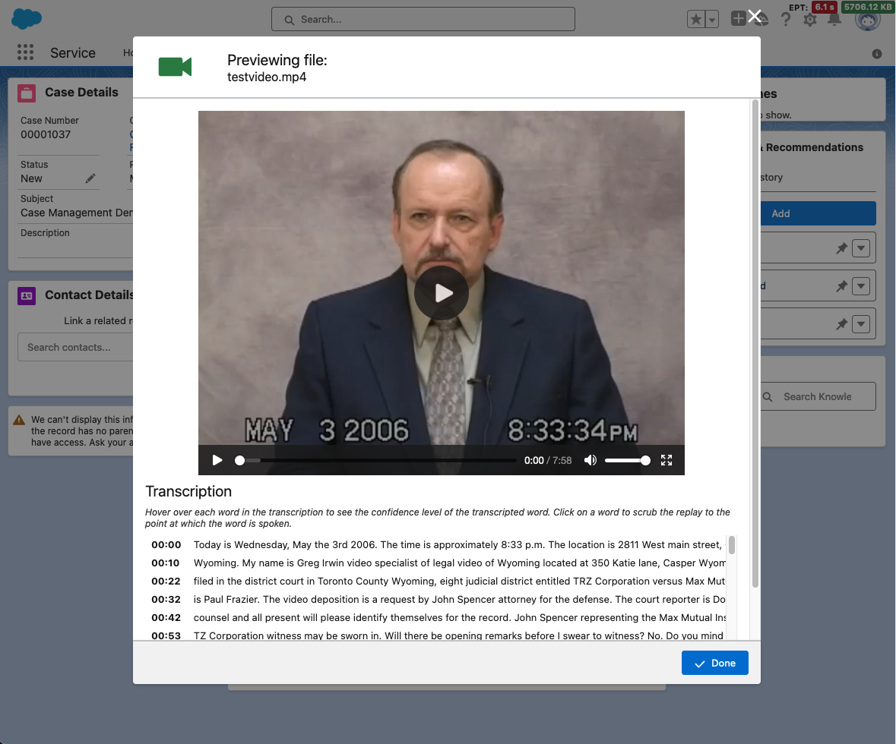

# Guidance for Content Management using Salesforce on AWS

## Table of Content (required)

List the top-level sections of the README template, along with a hyperlink to the specific section.

### Required

1. [Overview](#overview)
    - [Cost](#cost)
2. [Prerequisites](#prerequisites)
    - [Operating System](#operating-system)
3. [Deployment Steps](#deployment-steps)
    - [Deploy AWS](#deploy-aws)
   - [Deploy Salesforce Lightning Web Component](#deploy-salesforce-lightning-web-component)
4. [Deployment Validation](#deployment-validation)
5. [Running the Guidance](#running-the-guidance)
6. [Next Steps](#next-steps)
7. [Cleanup](#cleanup)

***Optional***

8. [FAQ, known issues, additional considerations, and limitations](#faq-known-issues-additional-considerations-and-limitations-optional)
9. [Revisions](#revisions-optional)
10. [Notices](#notices-optional)
11. [Authors](#authors-optional)

## Overview

In this guidance, c

1. Provide a brief overview explaining the what, why, or how of your Guidance. You can answer any one of the following to help you write this:

    - **Why did you build this Guidance?**
    - **What problem does this Guidance solve?**

2. Include the architecture diagram image, as well as the steps explaining the high-level overview and flow of the architecture.
    - To add a screenshot, create an ‘assets/images’ folder in your repository and upload your screenshot to it. Then, using the relative file path, add it to your README.

### Cost

You are responsible for the cost of the AWS services used while running this Guidance. As of February 2024 the cost for running this Guidance with the default settings in the us-east-1 region is approximately $875 per month for processing 1000 minutes of videos and 10000 images per month. This is not including the Amazon Kendra free tier that provides free usage of up to 750 hours for the first 30 days. This will allow you to evaluate the solution while in the free tier. Visit the [Amazon Kendra Pricing](https://aws.amazon.com/kendra/pricing) page for more information.

## Prerequisites

### Operating System
These deployment instructions are optimized to best work on a Mac or Linux environment.  Deployment in Windows may require additional steps for setting up required libraries and CLI.
Using a standard [AWS Cloud9](https://aws.amazon.com/pm/cloud9/) environment will have all the requirements installed.
- Install Python 3.7 or later including pip and virtualenv
- Install Node.js 14.15.0 or later
- Install [AWS CLI](https://docs.aws.amazon.com/cli/latest/userguide/getting-started-install.html)
- Install [AWS CDK Toolkit](https://docs.aws.amazon.com/cdk/v2/guide/cli.html)

### Supported Regions

This Guidance is built for regions that support Amazon Kendra. Supported regions are subject to change, so please review [Amazon Kendra endpoints and quotas](https://docs.aws.amazon.com/general/latest/gr/kendra.html) for the most up-to-date list.

## Deployment Steps
This project consists of two components, which have to be deployed seperately.  One to Salesforce, and one to AWS.

**BEFORE DEPLOYING**
This requires a certificate that can be used in both Salesforce and AWS.  For _DEV_ purposes, a self-signed cert is the easiest, but must be initiated on the Salesforce side.

### Generate Certificates
1. **Generate Certificates**: In the target Salesforce org, go to Setup > Certificate and Key Management > Create Self-Signed Certificate.
    * Here are instructions from Salesforce for creating a self-signed certificate: [Generate a Self-Signed Certificate](https://help.salesforce.com/s/articleView?id=sf.security_keys_creating.htm&type=5).
    * **Important:** Name that certificate `awsJWTCert`.  The component will only look for a certificate with that name.
2. Create and download the certificate.
3. Overwrite ([deployment/media-management-solution-cdk/cert.crt](deployment/media-management-solution-cdk/cert.crt)) with the new certificate you just downloaded.
### Deploy AWS
1. The CDK must first be deployed on AWS to create the necessary resources needed for the Salesforce Lightning Web Component (LWC).
2. Follow the instruction on [Media Management CDK](deployment/media-management-solution-cdk/README.md) to configure and deploy the CDK stack in your AWS Account.
3. The outputs that will be used in configuring the Salesforce LWC can be found in the CloudFormation outputs tab, or in the CDK CLI after a successful deployment:

### Deploy Salesforce Lightning Web Component
1. Have the Saleforce CLI installed. Here are instruction to install: [Install Salesforce CLI](https://developer.salesforce.com/docs/atlas.en-us.sfdx_setup.meta/sfdx_setup/sfdx_setup_install_cli.htm)
2. Change directories to the `deployment/sfdc` directory
3. If this is your first time using the sf CLI, you must first authorize your org with the CLI. Here is the [Authorization](https://developer.salesforce.com/docs/atlas.en-us.sfdx_dev.meta/sfdx_dev/sfdx_dev_auth.htm) guide. Use the option that best meets your needs. The option that meets most user's needs is [Authorize an Org Using a Browser](https://developer.salesforce.com/docs/atlas.en-us.sfdx_dev.meta/sfdx_dev/sfdx_dev_auth_web_flow.htm)

4. Run `sf project deploy start`.
   * Depending on your authorization and configuration, you may need to specify the directory and target org to look like this: `sf project deploy start  --source-dir deployment/sfdc --target-org <org-alias>`
   * Here is a [Salesforce CLI Command Reference](https://developer.salesforce.com/docs/atlas.en-us.sfdx_cli_reference.meta/sfdx_cli_reference/cli_reference_project_commands_unified.htm#cli_reference_project_deploy_start_unified)
5. Add the `AWS S3 Media Files` component to pages as desired.
6. Use the outputs from the CDK Deployment for the required inputs of the `AWS S3 Media Files` component:

## Deployment Validation

To validate the deployment, you will need to upload some media files to a case. In this example, you can see that a JPG image and MOV video file were successfully uploaded.

The processing in AWS runs asynchronously, so the results may take a few seconds to load. When looking at the outputs of an Image File, you will see the image metadata, image location, and results of Amazon Rekognition.

When looking at the outputs of a Video File, you will see the video preview, and the transcription with timestamps. There is also an option to download the transcription.

Here is a sample output of the Document generated.

## Running the Guidance

<Provide instructions to run the Guidance with the sample data or input provided, and interpret the output received.> 

This section should include:

* Guidance inputs
* Commands to run
* Expected output (provide screenshot if possible)
* Output description

## Next Steps

This Guidance provides the foundations for

## Cleanup
### Delete Stack
To clean up environment, AWS resources can be deleted using the CDK or CloudFormation. With CDK, run the `cdk destroy` command to delete the resources. With CloudFormation, you can go to the CloudFormation stack and click `Delete`
### Manually delete retained resources
After deleting the stack, there will be some resources that will be retained. You will need to manually delete these resources.
- Amazon S3 buckets will be retained:
  - `InputBucket`
  - `OutputBucket`
  - `TranscriptionBucket`
  - `LoggingBucket`
- Amazon Elastic Container Registry (ECR) will be retained:
  - `json2word_repo`
  - `exif_tool_repo`
  - `encoder_repo`
- In the EC2 Image Builder service, 3 container recipes and 1 infrastructure configurations will be retained.
  - Container recipes:
    - `json2word_recipe`
    - `exif_tool_recipe`
    - `encoder_recipe`
  - Infrastructure configurations:
    - `InfrastructureConfigurationContainerStack`

## FAQ, known issues, additional considerations, and limitations (optional)

**Known issues (optional)**

<If there are common known issues, or errors that can occur during the Guidance deployment, describe the issue and resolution steps here>

**Additional considerations (if applicable)**

<Include considerations the customer must know while using the Guidance, such as anti-patterns, or billing considerations.>

**Examples:**

- “This Guidance creates a public AWS bucket required for the use-case.”
- “This Guidance created an Amazon SageMaker notebook that is billed per hour irrespective of usage.”
- “This Guidance creates unauthenticated public API endpoints.”

Provide a link to the *GitHub issues page* for users to provide feedback.

**Example:** *“For any feedback, questions, or suggestions, please use the issues tab under this repo.”*

## Revisions (optional)

Document all notable changes to this project.

Consider formatting this section based on Keep a Changelog, and adhering to Semantic Versioning.

## Notices

**External Library Notice:**
*An external FFmpeg binary will be pulled from [https://www.johnvansickle.com](https://www.johnvansickle.com) for the [Encoder Dockerfile](deployment/media-management-solution-cdk/media_management_solutions_library/container_assets/EncoderRecipe/Dockerfile) container. It is the responsibility of the customer to abide by the licensing of FFmpeg.*

**Legal Disclaimer:**
*Customers are responsible for making their own independent assessment of the information in this Guidance. This Guidance: (a) is for informational purposes only, (b) represents AWS current product offerings and practices, which are subject to change without notice, and (c) does not create any commitments or assurances from AWS and its affiliates, suppliers or licensors. AWS products or services are provided “as is” without warranties, representations, or conditions of any kind, whether express or implied. AWS responsibilities and liabilities to its customers are controlled by AWS agreements, and this Guidance is not part of, nor does it modify, any agreement between AWS and its customers.*

## Authors

John Meyer - Salesforce Solutions Engineer (Retired)
Kyle Hart - AWS Principal Solutions Architect
Christian Ramirez - AWS Partner Solutions Architect
Kishore Dhamodaran - AWS Senior Solutions Architect
Jared Wiener - AWS Senior Solutions Architect