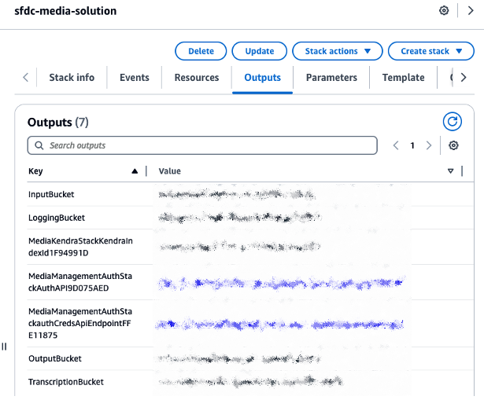
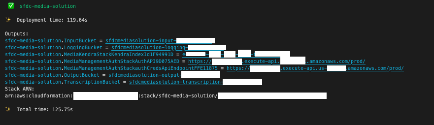

# Deploy sfdc-media-solution CDK Stack

You should explore the contents of this project. It demonstrates a CDK app with an instance of a stack (`media_management_solutions_library_stack`)
which contains an Amazon SQS queue that is subscribed to an Amazon SNS topic.

The `cdk.json` file tells the CDK Toolkit how to execute your app.

This project is set up like a standard Python project.  The initialization process also creates
a virtualenv within this project, stored under the .venv directory.  To create the virtualenv
it assumes that there is a `python3` executable in your path with access to the `venv` package.
If for any reason the automatic creation of the virtualenv fails, you can create the virtualenv
manually once the init process completes.

To manually create a virtualenv on MacOS and Linux:

```Shell
python3 -m venv .venv
```

After the init process completes and the virtualenv is created, you can use the following
step to activate your virtualenv.

```Shell
source .venv/bin/activate
```

If you are a Windows platform, you would activate the virtualenv like this:

```Shell
.venv\Scripts\activate.bat
```

Once the virtualenv is activated, you can install the required dependencies.

```Shell
pip install -r requirements.txt
```

At this point you can now synthesize the CloudFormation template for this code.

```Shell
cdk synth
```

# change the default parameters 
The CDK Stack will have default values set in the [app.py](app.py) file. Here are the parameters that you can change: 
- `enable_s3_kms_encryption` Is a boolean value. When True, it will use the KMS master key to encrypt S3. If False, Se will be encrypted with SSE-S3 default encryption.
- `deploy_kendra` Is a boolean value. When True, a Kendra will be deployed.
- `kendra_index_edition` Accepted values are: DEVELOPER_EDITION or ENTERPRISE_EDITION
- `deploy_video_rekognition` Is a boolean value. When True, an optional Video Rekognition stack will be deployed. Currently, the Salesforce LWC will not be able to render the results of Video Rekognition on the Salesforce Console. 
- `pub_cert` this is the string value of the self signed cert generated in Salesforce. If you overwrite [cert.crt](media-management-solution-cdk/cert.crt) with the self signed cert created in Salesforce, there is nothing to change here.

Deploy this CloudFormation template. 

```Shell
cdk deploy
```

The outputs that will be used in configuring the Salesforce LWC can be found in the CloudFormation outputs tab:



It is also avaiable in the CDK CLI after a sucessful deployment:




## Useful commands

 * `cdk ls`          list all stacks in the app
 * `cdk synth`       emits the synthesized CloudFormation template
 * `cdk deploy`      deploy this stack to your default AWS account/region
 * `cdk diff`        compare deployed stack with current state
 * `cdk docs`        open CDK documentation

Enjoy!
